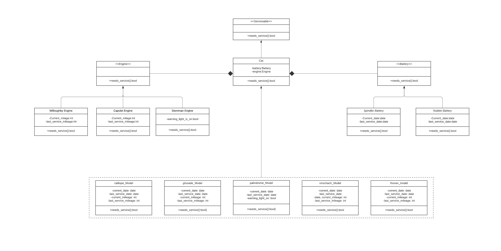
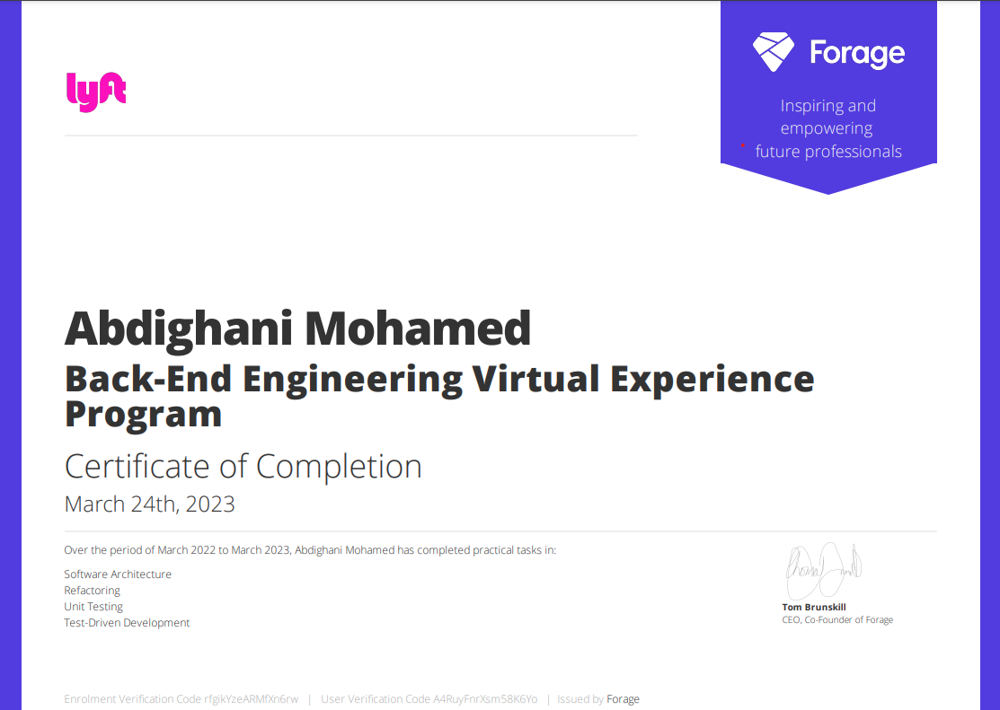

# **Lyft Back-End Engineering**

## virtual-experience
 -www.theforage.com
## Concepts Covered 

- UML Diagrams
- Software Design Patterns
- Python Modules
- Python OOPS
- Unit Testing
- Test-Driven Development (TDD)

## UML Diagram

## virtual-experience

## Author

- [@AbdighaniMD](https://github.com/AbdighaniMD)